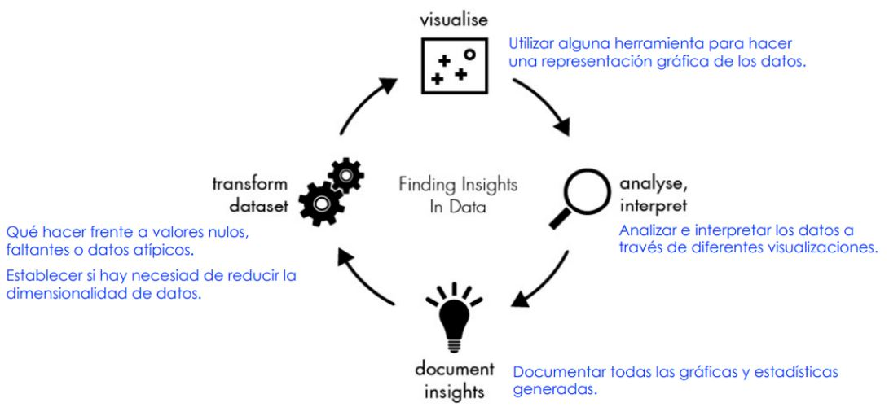

<h1 align="center"> Análisis Exploratorio de Datos </h1>
<h2 align="center"> COVID en México </h2>
El análisis exploratorio de datos (EDA) es un proceso no formal que sirve para analizar y
resumir sus principales características de los datos con el fin de manipularlos para descubrir
patrones, anomalías, contestar nuestras preguntas o reformular nuevamente.

El EDA se presenta como un apoyo gracias a la implementación de herramientas gráficas,
que nos ayudan a tener una mejor comprensión de las variables del conjunto de datos y las
relaciones entre ellas, que de otra forma nos sería más difícil conocer nuestros datos.

**Proceso básico de EDA.**

Tener una idea de la estructura del conjunto de datos, identificar la variable objetivo y posibles
técnicas de modelado.

  

El objetivo durante el EDA es desarrollar un entendimiento de los datos.

# Datos

### **Contexto**

Datos recopilados de manera diaria a nivel país sobre la vacunación contra COVID-19.

**Objetivo:** Hacer un análisis exploratorio de datos sobre el progreso mundial de vacunación contra COVID-19.

**Variables**

1. País: Nombre del país.
2. Código ISO: Código ISO del país.
3. Fecha: Fecha de registro.
4. Total de vacunaciones: Número total de vacunaciones en el país.
5. Total de personas vacunadas: Una persona, según el esquema de inmunización, recibirá una o más vacunas (normalmente 2).
6. Total de personas completamente vacunadas: Número de personas que recibieron el esquema completo de vacunación.
7. Vacunas diarias (crudos): Número de vacunaciones para esa fecha/país.
8. Vacunas diarias: Número de vacunaciones para esa fecha/país.
9. Total de vacunaciones por cien: Relación (en porcentaje) entre el número de vacunaciones y la población total hasta la fecha.
10. Total de personas vacunadas por cien: Relación (en porcentaje) entre la población inmunizada y la población total hasta la fecha.
11. Total de personas totalmente vacunadas por cien: Relación (en porcentaje) entre la población totalmente inmunizada y la población total hasta la fecha en el país.
13. Vacunas diarias por millón: Relación (en ppm) entre el número de vacunaciones y la población total para la fecha actual en el país.
14. Vacunas utilizadas en el país: Nombre de las vacunas utilizadas en el país (hasta la fecha).
15. Nombre de la fuente: Fuente de la información.
16. Sitio web de origen: Fuente de información.
## Código
https://colab.research.google.com/drive/1LRBLVSyIo8Fo5eI3JV8e9q3UcRQIVl3B?usp=sharing
## Conclusión 

Una vez que se ha aplicado EDA es posible aplicar un algoritmo debido a que ya se ha realizado un estudio de nuestros datos por lo que tendremos un mejor desempeño al implementar un algoritmo. Además gracias al EDA podemos obtener un análisis visual y númerico lo cual nos permite conocer mejor nuestros datos  

## Referencia
https://www.kaggle.com/gpreda/covid-world-vaccination-progress
